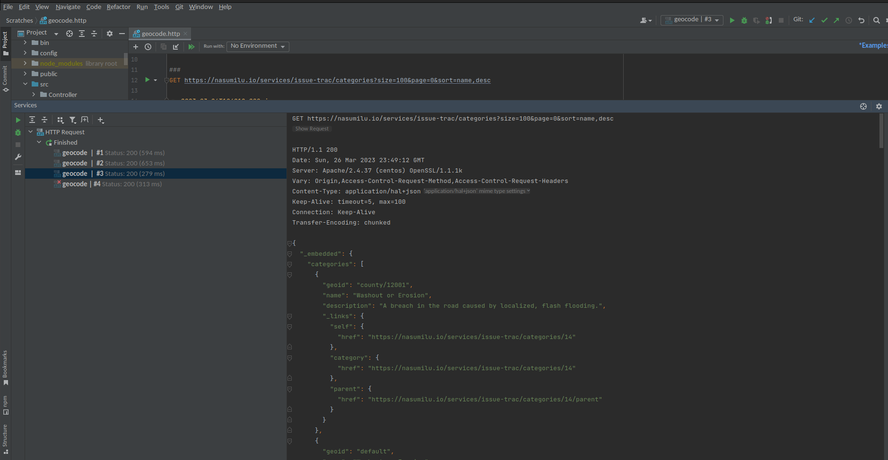
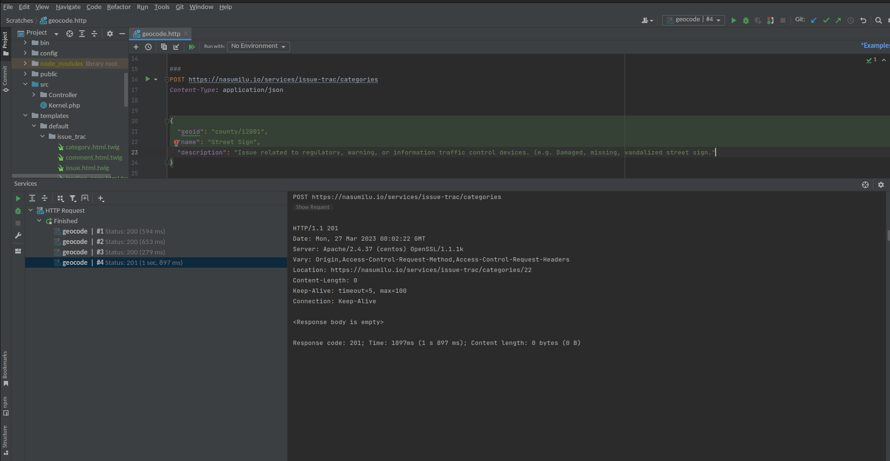
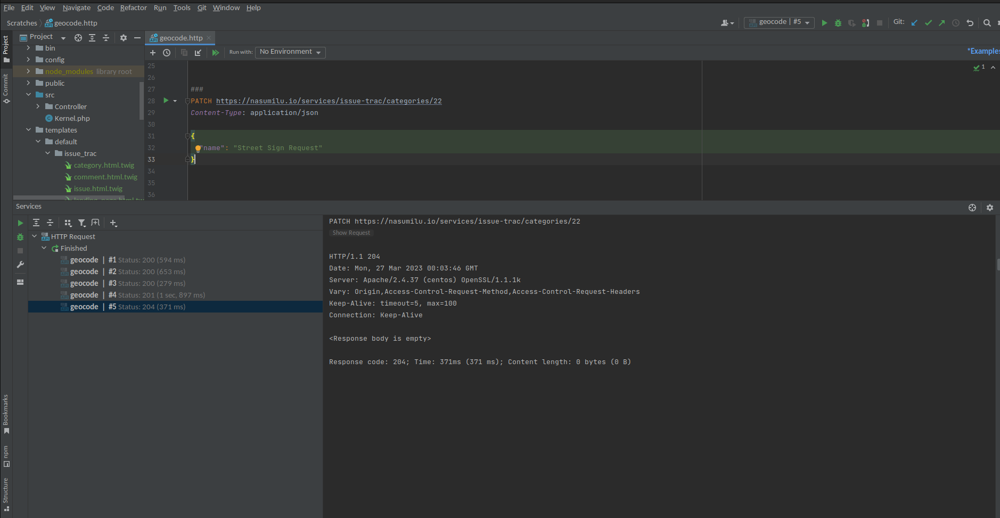
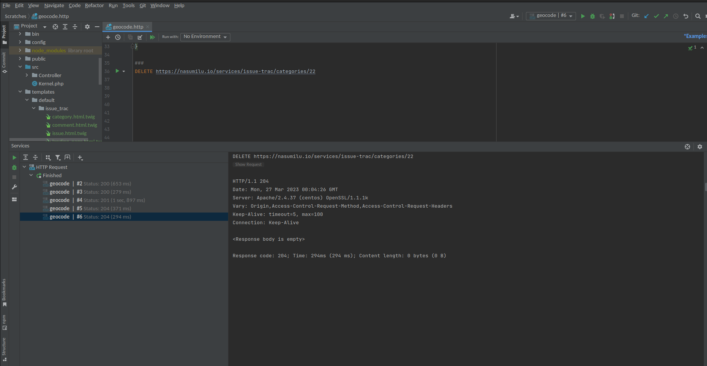

# IssueTrac API

Is a simple issue tracking/work management applications that will provide the necessary application programming
interface (API) to create, read, and update issues by providing an interface between application, database(s), and 
other backend web services.

> Still Underdevelopment

## Screenshots

These are screenshots take of the Jetbrains (IntelliJ IDEA) HTTP Client demonstrating the Issue Trac API.

### GET (Category)

## Class Diagram

